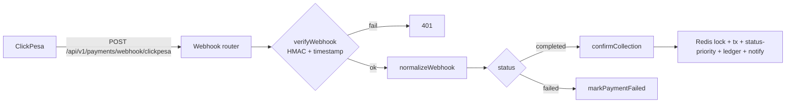
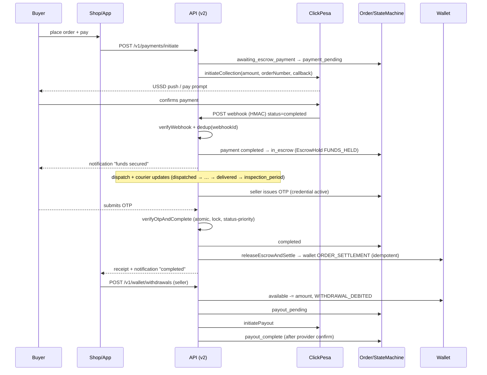
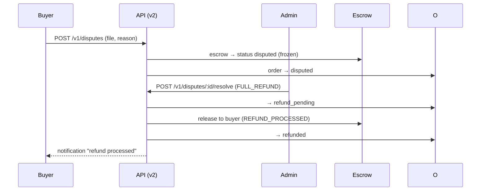
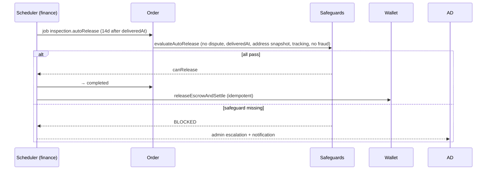

# Soko Vibe — Marketplace Payment & Escrow Architecture

Status: **Design v1 (architecture + gap analysis + integration plan)**
Scope: payment, order, escrow, shipping, OTP handover, seller payout, refund, dispute, retry/recovery, ledger, webhooks, notifications, admin.

This document is the design deliverable for the production-grade marketplace money system. It is **grounded in the current codebase**: it describes what already exists (v2 modular stack + legacy Firestore), the target architecture, and the gaps that must be closed. Nothing here rewrites working systems; integration is phased (see §22).

---

## 1. Purpose & Non-Negotiable Rules

The marketplace must protect buyer funds until delivery is genuinely confirmed, never lose seller funds, and never double-pay anyone.

Hard rules (enforced by design and by tests):

| # | Rule | Enforcement point |
|---|------|-------------------|
| 1 | **Never fake a payment success.** Money moves only on provider-verified collection (`Payment.status = completed` + escrow hold created server-side). | `payment-service.confirmCollection` |
| 2 | **Never trust frontend payment status.** The browser/app can only *request*; the server verifies with the provider. | Webhook + back-office polling paths only |
| 3 | **Never release seller funds immediately.** Settlement happens only from `COMPLETED` (OTP-verified or safeguarded auto-release). | `OrderStateMachine.canReleaseFunds` |
| 4 | **Never duplicate payouts.** Idempotency keys on payments, withdrawals, wallet ledger entries; status-priority checks. | UNIQUE constraints + layer-4 checks |
| 5 | **Never leave a payment stuck in PROCESSING.** Every non-terminal state has an owner, a timeout, and a recovery job. | Scheduled jobs + admin escalations |
| 6 | **Never delete financial transactions.** Ledger is append-only; corrections are `ADJUSTMENT` entries with audit. | `ledger-service` + `AuditLog` |
| 7 | **Never use floats for money.** BigInt (TZS, minor units) in v2; legacy Firestore uses integer TZS. | Prisma `BigInt` + `money.test.js` |
| 8 | **Never allow invalid state transitions.** Canonical state machine with transition + actor guards. | `order-state-machine.js` + tests |
| 9 | **Commission never hardcoded.** `config.business.platformCommissionPercent` (v2) and `PLATFORM_COMMISSION_PERCENT` (legacy); backend recomputes all amounts. | config, single source per stack |

---

## 2. Current-State Reality (two parallel stacks)

The live server runs **two mounted stacks** from `server/src/index.js`:

**Legacy v1 — Firestore, plain JS numbers (`server/*.js`)**
- Buyer web shop → `POST /api/orders/create` (flat single-product, `deliveryType:'local'`) → USSD push via `POST /api/create-marketplace-payment-link` → poll `GET /api/orders/:id/status`.
- Flutter seller app → `POST /api/orders/set-shipping-cost`, `/api/escrow/dispatch`, `users/withdrawals`.
- Money stored as integer TZS on Firestore documents; commissions `Math.round(effectivePrice * 0.035)`.
- Auto-release: `ESCROW_AUTO_RELEASE_DAYS` override, else 3d local / 7d regional; 48h OTP auto-complete in `server/routes/delivery_otp.js`.
- Today: **the path used by both the web shop and the Flutter apps is the legacy flow.**

**V2 modular — Prisma/Postgres + Redis + BullMQ (`server/src/`)**
- Entrypoint `server/src/index.js`; modules under `server/src/modules/`.
- Canonical order state machine, ClickPesa provider, payment webhooks, escrow/wallet/ledger, payouts, shipping quotes+validation, OTP handover, disputes + auto-release safeguards, reconciliation, trust, notifications, admin.
- Financial precision: Prisma `BigInt` (TZS minor units) everywhere.
- Re-serves legacy handlers via `src/modules/legacy-compat/*` under original `/api/*` paths (mounted at `src/app.js:256-272`).

Target state: the **v2 flow becomes the only flow** for money; legacy-compat keeps Firestore routes alive only for read/back-compat during migration, never for new money movement.

---

## 3. Target Overview

```mermaid
flowchart LR
  B[Buyer (shop/app)] -- place order --> O[Order]
  S[Seller] -- shipping quote --> O
  O -- submit --> P[Payment<br/>ClickPesa]
  P -- webhook verified --> E[EscrowHold FUNDS_HELD]
  E -- dispatch --> D[Delivery]
  D -- OTP handover/auto-release --> C[COMPLETED]
  C -- settlement txn --> W[Seller Wallet]
  W -- admin/seller withdrawal --> PO[PayoutTransaction]
  R[Reconciliation] -. periodic check .-> P
  N[Notifications] -. events on every transition .-> B,S
  A[Admin] -. approve quote/refund/payout, resolve dispute .-> E
```

Money flows: **Buyer → Escrow (provider-held) → Seller wallet only after confirmed completion → payout to seller M-Pesa on admin-approved withdrawal.** Platform commission split from escrow at settlement time.

---

## 4. Order & Escrow State Machine

Canonical states (`server/src/modules/orders/order-state-machine.js::ORDER_STATES`):

`draft, published, address_required, pending_shipping_fee, shipping_fee_submitted, shipping_fee_review, awaiting_escrow_payment, payment_pending, in_escrow, ready_to_dispatch, dispatched, in_transit, out_for_delivery, delivery_attempted, delivered, inspection_period, otp_pending, completed, wallet_credited, payout_pending, payout_complete, disputed, refund_pending, refunded, cancelled, expired, failed`

### 4.1 State Transition Table (canonical)

| From | → To | Actor | Financial rule |
|---|---|---|---|
| draft | published / cancelled / expired / failed | buyer, system | NO_UNAUTHORIZED_FINANCIAL_MOVEMENT |
| published | address_required / cancelled / expired | buyer, system | same |
| address_required | pending_shipping_fee / cancelled | buyer, system | same |
| pending_shipping_fee | shipping_fee_submitted / cancelled | seller, system | same |
| shipping_fee_submitted | shipping_fee_review / awaiting_escrow_payment / cancelled | seller, system | same |
| shipping_fee_review | awaiting_escrow_payment / cancelled | system | same |
| awaiting_escrow_payment | payment_pending / cancelled / expired / failed | system | NO_RELEASE_UNTIL_PROVIDER_VERIFICATION |
| payment_pending | in_escrow / cancelled / expired / failed | system | NO_RELEASE_UNTIL_PROVIDER_VERIFICATION |
| in_escrow | ready_to_dispatch / disputed / refund_pending / cancelled | system/buyer/admin | FUNDS_PROTECTED |
| ready_to_dispatch | dispatched / disputed / cancelled | seller | NO_UNAUTHORIZED_FINANCIAL_MOVEMENT |
| dispatched | in_transit / disputed / refund_pending | system, seller, courier | same |
| in_transit | out_for_delivery / delivery_attempted / disputed | system, courier | same |
| out_for_delivery | delivered / delivery_attempted / disputed | system, courier | same |
| delivery_attempted | out_for_delivery / delivered / disputed | system, courier | same |
| delivered | inspection_period / disputed / refund_pending | system, courier | same |
| inspection_period | otp_pending / disputed / refund_pending / completed | system, buyer | SETTLEMENT_AUTHORIZED (only on → completed) |
| otp_pending | completed / disputed / refund_pending | buyer, system | SETTLEMENT_AUTHORIZED (only on → completed) |
| completed | wallet_credited / disputed / refund_pending | system | SETTLEMENT_AUTHORIZED_LEDGER_TRANSACTION |
| wallet_credited | payout_pending / disputed / refund_pending | system | SETTLEMENT_AUTHORIZED_LEDGER_TRANSACTION |
| payout_pending | payout_complete / failed / disputed | seller, system | SELLER_WITHDRAWAL_ONLY |
| payout_complete | disputed | system | SELLER_WITHDRAWAL_ONLY |
| disputed | in_escrow / refund_pending / completed / cancelled | buyer, seller, admin | FUNDS_PROTECTED_PENDING_RESOLUTION |
| refund_pending | refunded / in_escrow | admin, system | FUNDS_PROTECTED_PENDING_RESOLUTION |
| refunded / cancelled / expired | terminal | — | no further movement |
| failed | awaiting_escrow_payment / cancelled | system | fresh retry only |

Actor matrix: buyer/seller/courier/admin/system as defined in `TRANSITION_ACTORS`. Every transition records `{from, to, financialRule, actor, actorId, reason, timestamp}` in the state-machine history and (in DB-backed callers) `statusChangedBy/statusChangedAt` on the order.

### 4.2 Money-states vs money-in-transit

- **IN_ESCROW → DISPUTED** freezes funds (`EscrowHold.status = disputed`).
- **COMPLETED / WALLET_CREDITED** are the only states where `canReleaseFunds(rule) === true`.
- **REFUNDED / CANCELLED** imply funds returned to buyer (escrow release to buyer, ledger `REFUND_PROCESSED`).
- **PAYOUT_*** states only ever move *already-settled* wallet balances out of the platform.

---

## 5. Payment Lifecycle

### 5.1 Initiate (`payment-service.initiatePayment`)
1. Redis lock `payment:{orderId}` (60s TTL).
2. Tx: load order, check owner + **state = awaiting_escrow_payment** + amount equality (`totalAmount === amount`).
3. Void any prior `initiated` payment for the order.
4. Provider `initiateCollection` (`clickpesa`) with callbackUrl `POST /api/v1/payments/webhook/clickpesa`.
5. Create `Payment{status: 'initiated', providerReference, idempotencyKey: init_{orderNumber}_{ts}}`.
6. Transition order → `payment_pending`.

### 5.2 Verification (`confirmCollection`)
Only two TRUSTED entry points: the provider **webhook** or an **admin/back-office poll** that re-queries the provider. Never the frontend.

1. Redis lock `collection:{orderReference}`.
2. Tx: order by `orderNumber`, latest non-terminal payment.
3. **Status-priority guard**: already IN_ESCROW → `ALREADY_IN_ESCROW` (no-op, not an error); only `payment_pending`/`failed` (+`force`) may proceed.
4. Server-side re-verify with provider when `providerPaymentId` missing (`queryCollectionStatus` must return `completed`).
5. Payment → `completed`, `verifiedAt = now`.
6. Create `EscrowHold{status: 'holding', amount}`.
7. Order → `in_escrow`, `paidAt`.
8. Escrow ledger: `EscrowTransaction{FUNDS_HELD, amount, refId: payment.id}`.

### 5.3 Failure (`markPaymentFailed`)
Webhook `status='failed'` → order `payment_pending → failed` (skip if not pending). Buyer may re-initiate (failed → awaiting_escrow_payment → payment_pending).

### 5.4 Amounts (all server-computed)
- **V2 model (live):** `totalAmount = productPrice + shippingFee` (buyer pays these); `platformCommission = round(productPrice × rate)` is **deducted from the seller entitlement at settlement** (`sellerEntitlement = totalAmount − platformCommission`), with `rate = config.business.platformCommissionPercent` (default **0.035**).
- **Legacy model (live):** buyer pays `totalAmount = effectivePrice + shipping + platformFee` on top, commission kept by platform at payout.
- `confirmCollection` re-validates `order.totalAmount === payment.amount` (BigInt-safe) on every path; the webhook value is only cross-checked, never the source of truth.
- **Divergence to resolve in Phase 6:** buyer-pays-top-up (legacy) vs deduct-from-seller (v2). Choosing one source of truth requires re-pricing one side and is deliberately out of the Phase-1 safety-net scope.

---

## 6. Shipping Lifecycle

| Step | Actor | v2 element |
|---|---|---|
| Submit seller quote | seller | `POST /api/v1/shipping/quotes` (`ShippingQuote` row) |
| Buyer address captured | buyer | `address_required → pending_shipping_fee` |
| Quote approved | buyer/system | `shipping_fee_submitted → shipping_fee_review` when `reviewRequired`, else → `awaiting_escrow_payment` |
| Validate destination (district/region) | system | `shipping-validation` guard |
| Dispatch + evidence (courier/tracking) | seller | `DISPATCHED`, sets `courierName/trackingNumber/dispatchedAt` |
| Status updates | courier/system | `in_transit → out_for_delivery → delivery_attempted → delivered` |

Shipping fee is held in escrow with the goods: `totalAmount` escrowed = product + shipping + commission; seller quote amounts are frozen in `shippingQuoteSnapshot`.

---

## 7. OTP Handover Lifecycle

Delivery verification so funds can never be released on a "delivered" claim alone.

1. Order reaches `delivered` → `inspection_period` (default 14d inspection « `DEFAULT_TIMERS`).
2. Seller triggers OTP issuance (`handover-service.issueOtp`) — **only from `inspection_period` or `otp_pending`**; any prior active credential is revoked; OTP is time-limited (`HANDOVER_OTP_TTL_MS` default 30 min), max 5 attempts, stored as `sha256(argon2-style salt:hash)` — plaintext is shown to the seller once to deliver via SMS/QR.
3. Buyer submits OTP (or courier scans QR with embedded credential token).
4. `verifyOtpAndComplete` (atomic, Redis lock `complete:{orderId}`):
   - status-priority guard (already completed → `ALREADY_COMPLETED`, retry-safe)
   - verify expiry + attempts + constant-time hash compare
   - mark credential `used`
   - order → `completed`, `completedAt`
   - **idempotent `releaseEscrowAndSettle`**: settle funds once (`walletLedgerEntry.idempotencyKey = settlement_{orderId}`; no double-credit), escrow → `released`, emit escrow transactions `SETTLEMENT_TO_SELLER` + `COMMISSION_TO_PLATFORM`, credit seller wallet `ORDER_SETTLEMENT`
   - create `Receipt`, append audit
5. Auto-release fallback: `autoReleaseService.autoRelease` transitions `inspection_period/delivered → completed` **only if the full safeguard set passes**.

**Auto-release safeguards** (`REQUIRED_SAFEGUARDS`): no open dispute, `deliveredAt` present, shipping-address snapshot present, tracking/courier evidence present, no critical fraud signal. If missing → `BLOCKED` and escalated, never silently released.

---

## 8. Seller Payout Lifecycle

Settlement ≠ payout. Settlement credits the seller's internal wallet at completion; payout is a separate, admin/seller-initiated cash-out through the provider (ClickPesa).

1. `wallet-service.getWallet(sellerId)` auto-creates wallet.
2. `requestWithdrawal` — guards: wallet active, `amount > 0`, sufficient available balance, min/max (`WITHDRAWAL_MIN`/`MAX`), **daily limit** (`DAILY_WITHDRAWAL_LIMIT`), creates `Withdrawal{pending}` + ledger `WITHDRAWAL_DEBITED` (balance updated atomically, idempotent key `ledger_{withdrawalId}`).
3. `processWithdrawal` (admin or scheduled) — only from `pending`; provider `initiatePayout(orderReference: W{id}, phone)`; withdrawal → `processing`; record `PayoutTransaction{processing}`.
4. `confirmPayout` — provider-confirmed success only; withdrawal → `completed`; `PayoutTransaction{completed}`; `totalWithdrawn += amount`. Status-priority guard makes re-confirmation idempotent.

**No settlement → no payout**: a seller can only withdraw what is `availableBalance`, which is only credited by `releaseEscrowAndSettle` from a `completed` order.

---

## 9. Refund Lifecycle

| Path | Trigger | Handling |
|---|---|---|
| Buyer cancel pre-escrow | `cancelled` before funds held | nothing to release; retry allowed |
| Cancel with funds held / delivered | `refund_pending` | escrow → released to buyer; ledger `REFUND_PROCESSED`; wallet untouched |
| Dispute → FULL_REFUND | admin resolution | `dispute → resolved`, order → `refund_pending` then `refunded` |
| Provider reversal / chargeback | reconciliation signal | `Refund` row + `CHARGEBACK` ledger |

Process gaps to close (see §21): a dedicated **refund-service** with an atomic `Refund{status}` machine (pending → processed → completed), notifications on each stage, and integration with ClickPesa void flow — currently only the legacy compat path performs buyer refunds and it applies a payout fee from the buyer's side.

---

## 10. Dispute Lifecycle

- Reasons: `WRONG_ITEM, DAMAGED_ITEM, FAKE_ITEM, NOT_RECEIVED, QUALITY_ISSUE` (buyer); `BUYER_FRAUD` (seller).
- `fileDispute` — only from disputable states; order → `disputed`; **escrow hold frozen** (`status = disputed`); `Dispute{open}` created.
- `resolveDispute` — admin only; outcomes map onto the state machine:
  - `FULL_TO_SELLER` → `inspection_period` (then OTP/auto-release normal path)
  - `FULL_REFUND` → `refund_pending` → refunded
  - `PARTIAL` → stays `disputed` pending split handling (to be completed: allowescrow split amounts)
- Evidence: `DisputeEvidence` model (uploads) + `AuditLog` for the resolution decision.

---

## 11. Retry, Timeout & Recovery Lifecycle

Principle: **no state is silo-ed**; every non-terminal, time-sensitive state has an owner + timeout + recovery job.

Planned scheduled jobs (BullMQ, `queue: finance`):

| Job | Schedule | Action |
|---|---|---|
| `payment.expire` | on 30 min | `awaiting_escrow_payment|payment_pending` past TTL → `expired` (+ notify buyer, allow re-initiate) |
| `otp.issueTimeout` | on OTP expiry | revoke pending OTP credential, notify seller to re-issue |
| `inspection.autoRelease` | 14d after `deliveredAt` | run `autoRelease`; if blocked → notify admin escalation |
| `withdrawal.process` | periodic | auto-process `pending` withdrawals within provider window; stuck `processing` past window → alert admin + reconcile |
| `reconciliation.run` | hourly | full vs ClickPesa query; diff → alert + `Reconciliation` rows |
| `dispute.escalate` | by SLA | open disputes past SLA → notify admin |
| `cast` | continuous | requests to re-verify previously failed webhook deliveries (outbox) |

Status-priority checks make every job idempotent: re-running a completed/expired job is a no-op, not a double-credit.

---

## 12. PostgreSQL Schema (Prisma, `server/prisma/schema.prisma`)

### 12.1 Existing financial models (already modeled)

| Model | Key fields | Guards already present |
|---|---|---|
| `Order` | snapshots (product/shipping-address/shipping-quote), `productPrice`/`shippingFee`/`platformCommission`/`totalAmount` BigInt, lifecycle timestamps | `@@map("orders")` |
| `OrderItem` | unit/total price BigInt, per-item `snapshot` | cascade delete |
| `ShippingQuote` | amount BigInt, seller, status, `estimatedDays` | |
| `Payment` | status, provider + reference ids, **`idempotencyKey @unique`** | UNIQUE envelope |
| `PaymentAttempt` | attempt number, provider response | |
| `EscrowHold` | **`orderId @unique`, `paymentId @unique`**, amount, status, `releasedAt` | 1:1 order guarantee |
| `EscrowTransaction` | type (`FUNDS_HELD`, `SETTLEMENT_TO_SELLER`, `COMMISSION_TO_PLATFORM`, …), amount, refId | |
| `CommissionTransaction` | amount BigInt, `rate Decimal(5,4)` | |
| `Refund` | amount, status, `processedAt` | (service layer pending) |
| `Wallet` | available/pending/frozen/totalEarned/totalWithdrawn BigInt, status | seller 1:1 |
| `WalletLedgerEntry` | **`idempotencyKey @unique`**, `balanceAfter`, type, refs | UNIQUE envelope |
| `Withdrawal` | **`idempotencyKey @unique`**, provider payout id, status | |
| `PayoutTransaction` | provider response JSON, status | |
| `Receipt` | amount, creator ids | |
| `OtpCredential` | salt:hash, attempts/max, expiry, status | |
| `Dispute` + `DisputeEvidence` | reason, status, resolution | |
| `Reconciliation` | state/status snapshot | |
| `AuditLog` | actor/action/target/diff | |

### 12.2 Schema additions required by this design

| Model / column | Rationale |
|---|---|
| `WebhookEvent` (id, provider, type, raw payload, signature, **delivery/failure tracking**) | webhook receipt + outbox + replay, replacing the current "status-priority instead of dedup" compromise |
| `Payment.status` enum string → constrain to `initiated\|pending\|voided\|completed\|failed` | prevents typos |
| `Refund` workflow columns: `mode` (full/partial), `refundedBy`, `correlationId`, `errorAt` | refund state machine |
| `EscrowTransaction` `idempotencyKey @unique` | close the small window where settlement ledger is guarded but escrow transactions aren't |
| `Withdrawal` `externalRef` / PayoutTransaction `providerPaidAt` | reconciliation matching |
| `Order.autoReleaseScheduledAt`, `inspectionDeadline` | scheduler bookkeeping |
| `Wallet` `availableBalance`/`pendingBalance` CHECK constraints ≥ 0 (if DB supports) | belt-and-braces vs BigInt math |
| Unique partial-index on `EscrowHold(orderId, status='holding')` where supported | promote "at most one active hold" from app logic to the DB |

---

## 13. API Endpoints

### 13.1 V2 canonical endpoints (live)
| Endpoint | Purpose |
|---|---|
| `POST /api/v1/orders` | create order (multi-item, snapshot) |
| `POST /api/v1/shipping/quotes` | seller submits shipping quote |
| `POST /api/v1/payments/initiate` | create payment + provider collection (body: orderId, provider, amount, phone) |
| `POST /api/v1/payments/webhook/clickpesa` | **provider webhook** (HMAC-verified) |
| `POST /api/v1/payments/:orderRef/verify` | admin back-office re-verification w/ provider query |
| `POST /api/v1/handover/otp/issue` | seller issues OTP credential |
| `POST /api/v1/handover/otp/verify` | buyer/courier completes via OTP → escrow release |
| `POST /api/v1/disputes` | file dispute |
| `POST /api/v1/disputes/:id/resolve` | admin resolution |
| `GET/POST /api/v1/wallet` | seller wallet + ledger |
| `POST /api/v1/wallet/withdrawals` | request withdrawal |
| `POST /api/v1/wallet/withdrawals/:id/process` | admin process |
| `POST /api/v1/wallet/withdrawals/:id/confirm` | confirm payout |
| `GET /api/v1/orders/:id` | order detail incl. payments/escrow/ledger (RBAC) |

### 13.2 Legacy endpoints still served (compat)
`POST /api/orders/create`, `POST /api/create-marketplace-payment-link`, `GET /api/orders/:id/status`, `POST /api/orders/set-shipping-cost`, `POST /api/escrow/dispatch`, `GET /api/admin/*`, `users/withdrawals`.

Transition plan: new money flows use v2; legacy endpoints are read/decommissioned per phase (see §22).

### 13.3 Idempotency contract
Client POSTs may carry `Idempotency-Key`; server guarantees at-most-once side effects for financial POSTs (payment initiate, withdrawal, OTP verify, dispute resolve) using DB unique keys + locks + status priority.

---

## 14. Webhook Architecture & Security



- Signature verification via `provider.verifyWebhook(payload, signature)` (timing-safe `safeEqual`); per-provider HMAC secret.
- Legacy webhook additionally enforces an IP allowlist + HMAC.
- A webhook that fails mid-processing is recorded and re-deliverable (outbox); the status-priority guard makes replays safe.
- **Required hardening**: persist parsed webhook + raw in `WebhookEvent` *before* processing; dedupe on a provider webhook id (this restores the documented "Layer 2" that status-priority replaced in comment at `payment-service.js:187-188`).

---

## 15. Idempotency Strategy (4 layers)

| Layer | Mechanism | Status today |
|---|---|---|
| 1 | Redis SETNX lock per financial key (60s TTL) | ✅ implemented (`config/redis.acquireLock`); **fail-open** on Redis error → durability reliance shifts to DB |
| 2 | Outbox/BullMQ job-ID dedup on provider webhook id; `WebhookEvent` table | ⚠️ documented in `payment-service.js` but **not implemented** — primary gap |
| 3 | DB UNIQUE on `Payment.idempotencyKey`, `WalletLedgerEntry.idempotencyKey`, `Withdrawal.idempencyKey` | ✅ implemented |
| 4 | Status-priority check before any state change; settled/terminal states are no-ops on replay | ✅ implemented across payment/OTP/payout/dispute/auto-release |

Guideline: **optimistic concurrency** — locks are for coordination, DB uniqueness and state-machine guards are the source of truth. In this design the settlement idempotency key is `settlement_{orderId}` (correct); payment init uses `init_{orderNumber}_{ts}` (fine, since duplicates are voided before create).

---

## 16. Ledger Model

Double-entry conceptual ledger over the append-only tables (`EscrowTransaction`, `WalletLedgerEntry`).

Core identity: **Buyer payment = Seller entitlement + Platform commission + authorized adjustments.**

| Event | Debit | Credit |
|---|---|---|
| Collection confirmed | — (external) → escrow FUNDS_HELD | `EscrowTransaction.FUNDS_HELD` |
| Settlement (completion) | escrow | seller wallet: `WalletLedgerEntry.ORDER_SETTLEMENT` = `totalAmount − platformCommission` |
| Commission | escrow | platform: `EscrowTransaction.COMMISSION_TO_PLATFORM` (+ `CommissionTransaction` row) |
| Withdrawal request | seller wallet | payout float: `WalletLedgerEntry.WITHDRAWAL_DEBITED` |
| Payout confirmed | payout float → external | `PayoutTransaction.completed`, `totalWithdrawn +=` |
| Refund | escrow → buyer | `EscrowTransaction REFUND_PROCESSED` |
| Chargeback | platform | `CHARGEBACK` |
| Correction | audited | `ADJUSTMENT` (never delete) |

Invariants enforced by code/tests:
- `sum(FUNDS_HELD − SETTLEMENT_TO_SELLER − COMMISSION_TO_PLATFORM − REFUND_PROCESSED − CHARGEBACK) = 0` per escrow hold.
- Wallet `availableBalance == last ledger.balanceAfter` (checked by `reconcileWallet`; legacy parity check added in migration phase).
- Money never leaves the books twice: every credit carries a unique `idempotencyKey`.

---

## 17. Notification Events (buyer/seller/admin)

Unified notification service (`server/src/…/notifications`) with typed events (19 `NOTIFICATION_TYPES`), channels SMS/Mail/push, localized (sw/en).

| Order/Finance event | Recipient | Template intent (sw/en) |
|---|---|---|
| Order created | seller | "Oda mpya imewasili" / New order |
| Payment initiated | buyer | "Malipo yanaendelea" / Payment in progress |
| Payment completed → in escrow | buyer | "Malipo yamepokelewa, pesa zako ziko escrow" / Funds secured |
| Payment failed | buyer | "Malipo yameshindikana, jaribu tena" / Retry |
| Shipping quote submitted | buyer | "Bei ya usafirishaji imewasilishwa" / Quote ready |
| Dispatched | buyer | "Oda imeharakatiwa" / Dispatched |
| OTP issued | buyer | "Msimbo wa OTP umetumwa" / Delivery code sent |
| Order completed / funds to seller | both | buyer: "Umepokea oda yako"; seller: "Pesajakukodiwa" / Completed |
| Wallet credited | seller | "Escrow imetolewa, salio limeongezwa" / Wallet credited |
| Withdrawal submitted | seller | "Ombi la kutoa pesa limepokelewa" |
| Payout paid | seller | "Pesa zimetumwa M-Pesa" / Payout sent |
| Withdrawal rejected | seller | "Ombi limekataliwa" / Rejected + reason |
| Dispute filed | admin + counterparty | "Mtafaruku umesajiliwa" / Dispute filed |
| Dispute resolved | both | "Uamuzi wa mtafaruku" / Resolution |
| Refund processed | buyer | "Pesa zimerudishwa" / Refunded |
| Auto-release blocked | seller + admin | "Utoaji otomatiki umekwama" / Escalated |
| Reconcilation warning | admin | "Tofauti ya malipo" / Diff alert |
| Expired order | buyer | "Oda imemalizika muda" / Expired |
| New dispute SLA reminder | admin | escalation |

Rule: notifications are **side-effects of ledger/state transitions**, fired inside the same service (after the tx commits), never the cause of the money movement.

---

## 18. Admin Controls

Admin surface (v2 `modules/admin/routes.js` + legacy `admin-compat`):

| Capability | Endpoint / action |
|---|---|
| Order search & override with audit | admin order view, `statusChangedBy` in `AuditLog` |
| Shipping quote review | approve/reject; review-required states |
| Payment re-verification | `POST /api/v1/payments/:orderRef/verify` (force) |
| Escrow manual release / refund (with reason, audit) | admin tools → `refund_pending`/`refunded` |
| Withdrawal processing pipeline | approve → `processWithdrawal` → `confirmPayout` |
| Dispute resolution | `POST /api/v1/disputes/:id/resolve` |
| Reconciliation reports | `Reconciliation` viewer, ClickPesa query diff |
| Block/unblock seller wallet | wallet freeze (status), trust/quality gates |

**Every admin financial action must produce an `AuditLog` row with actor + diff.** No admin endpoint may bypass the state machine; it may use `force` verification but only after a provider re-query.

---

## 19. Security Rules

| Area | Rule |
|---|---|
| Transport | TLS everywhere; webhook endpoint + back-office only |
| Payment initiation | buyer == order.buyerId; amount server-recomputed; state machine gate |
| Webhooks | HMAC verification (timing-safe), outbox replay, provider webhook id dedup, optional IP allowlist (legacy) |
| OTP | salted SHA-256 hash at rest, constant-time compare, TTL 30min, max 5 attempts, one active credential, credential revocation on re-issue, plaintext returned once to the issuing seller |
| AuthN/RBAC | buyer/seller/admin/courier roles enforced per endpoint; tests in `auth-rbac.test.js` |
| Money math | BigInt integer TZS; no floats; `money.test.js` |
| State machine | transition + actor guards; tests in `order-state-machine.test.js` |
| Ledger | append-only, unique idempotency keys, `ADJUSTMENT` for corrections |
| Secrets | gateway secrets in env, never in repo/response |
| Rate limiting | dashboards/login + payment-init endpoints (existing limiter) |
| Audit | every financial transition logable to `AuditLog` |

---

## 20. Sequence Diagrams

### 20.1 Happy path (payment → escrow → OTP → payout)



### 20.2 Dispute → refund



### 20.3 Auto-release (no OTP received)



---

## 21. Gap Analysis — Spec vs Legacy vs V2

Legend: ✅ implemented / ⚠️ partial / ❌ missing.

| Spec requirement | Legacy (Firestore, live) | V2 (Postgres) | Action |
|---|---|---|---|
| Payment via provider, verified server-side | ✅ ClickPesa USSD | ✅ ClickPesa + webhook | — |
| No fake success / no trusting frontend | ✅ (server marks paid) | ✅ | — |
| Escrow hold until delivery verified | ✅ Firestore holds | ✅ `EscrowHold` | — |
| OTP/QR handover | ⚠️ `delivery_otp.js` 48h auto-complete | ✅ hash OTP + QR | — |
| Release only after OTP or safeguarded auto-release | ⚠️ 48h/3d/7d timers, weaker safeguards | ✅ `REQUIRED_SAFEGUARDS` | align legacy timers to v2 config |
| Seller payout on withdrawal (not instant) | ⚠️ autoPayout opt-in credits seller balance at delivered | ✅ wallet + admin withdrawals | migrate sellers to wallet model |
| Payout idempotency (no double) | ⚠️ strings, no unique keys | ✅ unique keys + status guard | — |
| Refund workflow | ⚠️ legacy cancel-refund only, fee deducted | ❌ model only; dispute FULL_REFUND partially wired | **build refund service** |
| Dispute resolution + freeze | ⚠️ manual Firestore | ✅ file + resolve + freeze; PARTIAL split incomplete | complete PARTIAL split |
| Reconciliation with provider | ❌ none | ⚠️ service exists; no scheduled run | wire scheduler + UI |
| Webhook dedup/outbox (Layer 2) | ⚠️ HMAC + IP allowlist, no dedup | ❌ status-priority only | **add WebhookEvent outbox** |
| Scheduled retry/timeout jobs | ⚠️ ad-hoc timers (setTimeout/48h) | ❌ auto-release runs nowhere | **build finance scheduler (BullMQ)** |
| Ledger (double-entry) | ❌ none in Firestore | ✅ wallet + escrow ledgers | backfill/parity tool |
| Notification events per finance event | ⚠️ partial OneSignal | ✅ typed events | map + coverage tests |
| Admin financial controls | ⚠️ scattered | ✅ admin module | audit-log every action |
| BigInt precision | ❌ ints (fine, but untyped) | ✅ BigInt | — |
| Status machine single source | ⚠️ inline strings | ✅ canonical machine | make legacy route through v2 machine |
| Commission configurable | ⚠️ env + hardcoded 0.035 fn | ✅ config | single rate source |
| **Two clients route through v2** | — | — | **migrate shop + Flutter seller flows to v2 endpoints** (biggest real gap: today both use Firestore) |

### Top-5 high-impact gaps
1. **Clients still use legacy money flow** (web shop `/api/orders/create` + Flutter `/api/escrow/dispatch`) — v2 is built but not the live path for buyers/sellers.
2. **No finance scheduler** — `autoRelease`, payment expiry, withdrawal processing, reconciliation never run automatically; only manual admin triggers.
3. **Webhook Layer-2 dedup/outbox missing** — documented but not implemented.
4. **Refund is under-built** — no v2 refund service; partial refunds unsupported.
5. **Two money models drift** — legacy seller auto-payout vs v2 wallet; timers 48h/3d/7d vs v2 14d; numbers vs BigInt.

---

## 22. Integration Plan (phased, no rewrites)

Ground rule: **never break the live shop/app.** Each phase ends green: tests pass, live smoke checks pass.

- **Phase 0 (done):** discovery + this document.
- **Phase 1 — Safety net (DONE, shipped with Phase-1 note below):** finance scheduler (BullMQ `finance` queue) for `payment.expire`, `inspection.autoRelease`, `withdrawal.process`, `reconciliation.run`, `dispute.escalate` with idempotent jobs + admin alerts; `WebhookEvent` outbox (Layer-2 webhook dedup); BigInt-safe amount comparison (fixes v2 `AMOUNT_MISMATCH` that could strand `payment_pending` orders).
- **Phase 2 — Refund service (DONE, shipped):** v2 `refunds` module (`/api/v1/refunds`) with `Refund` lifecycle (pending → processing → completed / failed); escrow release to buyer (`REFUND_TO_BUYER` + `released_to_buyer` on `EscrowHold`), provider payout to buyer's phone, partial refund support (order resumes `in_escrow`, remainder settles at OTP/auto-release), full refund (order → `refunded`, escrow fully returned). `resolveDispute(FULL_REFUND)` now opens a pending `Refund` record automatically; admin `processRefund` executes the money movement. Notifications (in-app `Notification` row + OneSignal) + `finance.refundUnstuck` watchdog (30min) that flags stranded refunds. Policy: v2 refunds the gross amount (platform bears the payout fee — diverges from legacy which deducted the ClickPesa fee from the buyer; resolved in Phase 6). Scope guard: only escrow-funded states are refundable pre-settlement (`in_escrow`, `dispatched`, `delivered`, `inspection_period`, `otp_pending`, `refund_pending`); transit states route through disputes; post-settlement (`completed`/`wallet_credited`) clawback is a later phase.
- **Phase 3 — Dispute completion (DONE, shipped):** `resolveDispute` now executes the money movement — `FULL_TO_SELLER` settles the seller immediately (DISPUTED → completed via the shared `releaseEscrowAndSettle`, idempotent `settlement_<orderId>` key, so a later OTP verify is a no-op); `PARTIAL` validates the split (`buyerAmount + sellerAmount == escrow available`, no floats, no leftover) and opens a partial `Refund` (order → refund_pending, executed by `processRefund`; seller share stays in escrow and settles at OTP/auto-release); `FULL_REFUND` opens the refund record as before. Split amounts are recorded in `Dispute.resolutionDetails`. Escrow release now also matches `disputed` holds (OTP path unaffected). SLA escalation (`finance.disputeEscalate`) now notifies the buyer AND seller (OneSignal) in addition to admins. Evidence room hardened: `addEvidence` is restricted to dispute parties and admins (was open to any authenticated user).
- **Systemic fix shipped with Phase 3:** `req.user.uid` never existed (auth sets `req.user.id` = DB uuid). 21 call sites across orders/order-controller, shipping, disputes, handover, and feed passed `undefined` as the actor — every v2 order/escrow/OTP/dispute path was broken (masked in production because clients use legacy-compat routers). Fixed with correct semantics: buyer-scope uses `req.user.id`; seller-scope resolves the acting user's `SellerProfile.id` (`Order.sellerId`/`ShippingQuote.sellerId` reference SellerProfile). OTP bypass closed: `POST /api/v1/orders/:id/complete` now requires a real OTP and delegates to `handoverService.verifyOtpAndComplete` (escrow release is OTP-gated, never a button press).
- **Phase 4 — Migration of buyers (web shop):** data MIGRATION DONE (shipped): `server/scripts/migrate-escrow-orders.js` — idempotent backfill of legacy Firestore `transactions` → v2 `orders`, preserving status + `paidAt` + money as BigInt, with entity sync (`User`/`SellerProfile`/`Wallet` backfilled from Firestore `users/{uid}` when missing, since the v2 `users` table held only the admin), and escrow reconstruction (`orders`/`payments`/`escrow_holds`/`refunds`). New `Order` columns `legacyFirestoreId` (unique idempotency marker) + `legacySnapshot` (full legacy provenance: `escrowStatus`, `escrowReleased`, `confirmedBy`, `cancellationType`, `refundFee`, `autoReleaseDays`, `clickpesaReference`, `dispatchProof`, `buyerTransport`). Dry-run by default (`--commit` to write). Ran against production: 200 Firestore docs scanned → 29 orders migrated (incl. the single live `escrow_hold` → `in_escrow` 540 TZS), 6 seller wallets ensured. 171 docs skipped (failed/pending/cancelled without resolvable seller — no money held; reported in output). **Still PENDING → NOW DONE (shipped):** web shop checkout wired to v2 — new `server/src/modules/legacy-shop/` mounts the shop SPA's original paths (`POST /api/orders/create`, `POST /api/create-marketplace-payment-link`, `GET /api/orders/:orderId/status`) BEFORE legacy-compat so they execute against Postgres with the SAME response shapes (zero client change). `/api/orders/create` builds a v2 order (BigInt, `AWAITING_ESCROW_PAYMENT`, seller profile resolved/created from `sellerId` firebaseUid) and returns `{success, order:{orderId}}`; the payment link delegates to `paymentService.initiatePayment` (ClickPesa v2 collection → `/api/v1/payments/webhook/clickpesa`, OTP-gated escrow release); status translates v2 → legacy strings (`escrow_hold`, `dispatched`, …) for the SPA's poll states. Buyers are entity-synced on first authenticated request (`users` row created from Firebase Auth) so the old Flutter identities finally exist in Postgres — this organically completes the entity backfill that the migration script did for historical rows. Note: keep-order creation `pending_shipping_fee`→`awaiting_escrow_payment` shortcut matches legacy shop behavior (buyer pays immediately); seller fulfill still relies on v2 seller endpoints (Phase 5).
- **Phase 5 — Migration of sellers (Flutter) — partial (commission parity shipped):** `src/utils/commission-parity.js` restores the legacy money math that v2 had accidentally changed: buyers pay the 3.5% platform fee ON TOP of price+shipping plus the ClickPesa USSD push fee as a pass-through (`getUssdPushFee` — shared with legacy, July 2026 official tiers), so `platformCommission = round(price·3.5%) + ussdFee`, `totalAmount = price + shipping + commission`, and `sellerEntitlement = totalAmount − commission = price + shipping` exactly as sellers are paid today (no silent deduction from sellers). Applied at order placement (`/api/orders/create` legacy-shop) AND at `approveShippingQuote` (v2 native flow). **Double-payout guard shipped:** `finance.inspectionAutoRelease` now skips orders with `legacyFirestoreId` — migrated escrow lives in BOTH systems; until the legacy release path is dead, a v2 auto-release would pay the same escrow twice. Wallet backfill: wallets are ensured for migrated sellers (zero balances) but legacy balances are intentionally NOT copied (legacy provider payouts still happen until cutover — copying would duplicate money). `autoPayout` retirement is deferred to Phase 6 together with killing legacy money mutations.
- **Phase 6 — Parity & decommission — step 1 (reconciliation) shipped:** `server/scripts/reconcile-money.js` (read-only by default; `--fix` applies accounting-only repairs) cross-checks Firestore `transactions` vs Postgres. Prod verdict (2026-09-09): live escrow **540 TZS == 540 TZS** (Firestore == Postgres, 1:1); 45 money-bearing docs, of which the 29 migrated are the only real seller orders — the 16 outstanding are credits/subscriptions (`coins_*`, `premium_*`, `silver_*`), paymaster/dev tests (`pmq*`, `pmr*`, "Test" products) and anonymous `quoted` docs with no seller (deferred to cutover; no escrow at risk). `--fix` realigned 2 `payment_pending` migrated orders whose legacy total embedded the USSD fee but stored commission was only 3.5%·price (18→72, 175→755; pure accounting — those buyers never paid, no settlement impact) and backfilled 21 missing `CommissionTransaction` rows (rate 0.035, from already-paid totals — no money moved). Reconcile now reports drift 0. Remaining: seller-app wallet/withdrawal on v2, commission parity for any late-migrated orders, retire `autoPayout`, make legacy money endpoints read-only, kill legacy money mutations.
- **Phase 7 — Hardening:** reconcile daily, rate-limit all financial APIs, security audit (webhook, OTP, RBAC), runbook + on-call alerts.

> **Phase-1 implementation notes**
> - New table `webhook_events` (see §12.2). Apply to the running DB with `npx prisma db push` (the repo has no migration history); the outbox degrades to an in-memory dedupe until the table exists.
> - New config block `config.finance` (envs: `FINANCE_WORKER_IN_PROCESS=false` for dedicated-worker setups, `FINANCE_PAYMENT_EXPIRE_MS`, `FINANCE_WITHDRAWAL_AUTO_PROCESS_MIN`, `FINANCE_WITHDRAWAL_STUCK_HOURS`, `FINANCE_RECONCILIATION_WINDOW_HOURS`, `FINANCE_DISPUTE_SLA_HOURS`). Schedules are registered idempotently (BullMQ repeatable `jobId`).
> - Payment expiry never expires a `payment_pending` order without a provider re-query; a confirmed-but-lost-webhook payment is recovered via `confirmCollection` instead of being expired (trapped-money protection).
> - Deployment gotcha: the checked-in `Dockerfile`, `render.yaml` and `railway.json` all start `node index.js` (legacy). The live health endpoint (`/health` with DB+Redis checks) confirms production actually runs the v2 entrypoint `src/index.js`. These deploy files are stale and should be updated to `node src/index.js` (and run the worker where a dedicated worker is desired).